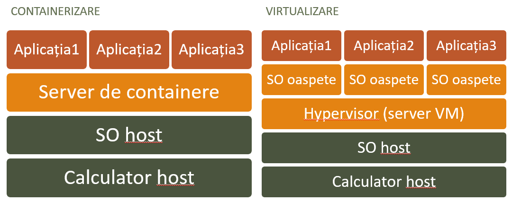

# Introducere / Istorie

- [Introducere / Istorie](#introducere--istorie)
  - [Idee de izolare a proceselor](#idee-de-izolare-a-proceselor)
  - [Noțiune de containerizare](#noțiune-de-containerizare)
  - [Domeniu de utilizare](#domeniu-de-utilizare)
  - [Avantaje și dezavantaje](#avantaje-și-dezavantaje)
  - [Istoria dezvoltării containerizării](#istoria-dezvoltării-containerizării)
  - [Bibliografie](#bibliografie)
  - [Lista termenilor](#lista-termenilor)

Aplicații moderne utilizează arhitectura modulară în careva mod: aceasta este determinată de faptul că aplicațiile rulează în cadrul sistemului de operare și interacționează cu acesta. Cu toate acestea, există situații în care sistemul de operare nu are o anumită bibliotecă necesară pentru a rula aplicația. În acest caz, furnizorul aplicației trebuie să fie sigur că produsul său va fi rulat și va funcționa independent de mediu, așa că trebuie să asigure aplicației toate dependențele sale, nu să se bazeze pe faptul că sistemul de operare de pe computerul utilizatorului are biblioteca necesară.

Un alt aspect important de lucru a aplicațiilor este securitatea: nici o altă aplicație nu trebuie să influențeze în mod neautorizat funcționarea aplicației software, la fel cum aplicația software nu trebuie să influențeze alte aplicații.

Pentru a rezolva aceste probleme, - plenitudinea mediului de program și izolarea acestuia de alte programe - au fost propuse două abordări: virtualizarea și containerizarea (ca un caz particular al virtualizării).

## Idee de izolare a proceselor

__Izolarea proceselor__ este o posibilitate de a porni mai multe procese în cadrul unui singur sistem de operare, dar cu resurse izolate. Aceste procese nu pot influența unul pe altul, iar funcționarea lor nu depinde unul de altul. Izolarea proceselor permite rularea mai multor aplicații pe un singur host, fără a vă face griji că o aplicație poate afecta funcționarea alteia. Izolarea proceselor permite rularea mai multor aplicații pe un singur host, fără a vă face griji că o aplicație poate afecta funcționarea alteia. Izolarea proceselor permite rularea mai multor aplicații pe un singur host, fără a vă face griji că o aplicație poate afecta funcționarea alteia.

Scopul izolării proceselor este securitatea și fiabilitatea aplicațiilor. Dacă o aplicație se încheie cu o eroare, aceasta nu afectează funcționarea altor aplicații. Dacă o aplicație este supusă unui atac, aceasta nu afectează funcționarea altor aplicații.

## Noțiune de containerizare

Sub __virtualizarea__ se înțelege tehnologia care permite rularea unei instanțe a unui sistem de operare în cadrul altui sistem de operare (numit gazda / __host__). Pentru virtualizare, hipervizorul (software-ul de virtualizare) implementează emularea hardware-ului (procesor, memorie, spațiu de stocare, interfețe de rețea etc.), adică creează o mașină virtuală pe care se instalează sistemul de operare. Virtualizarea permite rularea mai multor instanțe ale aceluiași sistem de operare pe un singur gazdă. Fiecare instanță are propriile sale procese, sistem de fișiere, interfețe de rețea și utilizatori.

__Containerizarea__ este o metodă de virtualizare care utilizează resursele nucleului sistemului de operare. Aceasta este o diferență față de virtualizarea obișnuită, în care are loc emularea hardware-ului. Containerizarea este adesea utilizată pentru a crea instanțe izolate ale aplicațiilor specifice, nu a întregului sistem de operare. Aceste instanțe izolate ale aplicațiilor se numesc containere.

Containerizarea, spre deosebire de virtualizare, consumă mult mai puține resurse, deoarece:

- nu emulează hardware-ul, ci oferă acces la hardware-ul gazdă.
- nu creează un sistem de operare gazdă care consumă resurse suplimentare;

## Domeniu de utilizare

Apariția virtualizării este legată de necesitatea de a oferi spațiu de lucru mai multor utilizatori pe un singur computer fizic. În timp, virtualizarea a devenit un element important al tehnologiilor informaționale moderne și a ocupat un loc central în domeniul calculului în cloud.

Totodată virtualizarea permite crearea mediilor de dezvoltare și testare izolate pentru software, ceea ce facilitează dezvoltarea și îmbunătățește calitatea software-ului.

În ciuda faptului că ideea originală a containerizării se referea la securitate și fiabilitate, în prezent containerele sunt utilizate în principal pentru dezvoltarea, testarea și implementarea produselor software. Containerele permit crearea de produse software care rulează pe orice sistem de operare, nu depind de hardware și nu necesită instalarea dependențelor suplimentare.

Domeniul de aplicare al containerelor:

- _Dezvoltarea de produse software_ - crearea de produse software este posibilă pentru orice sistem de operare;
- _Testarea produselor software_ - depanarea programelor în containere este mai sigură și mai ușoară;
- _Asamblarea produselor software_ - asamblarea programelor în containere permite evitarea problemelor cu dependențele;
- _Implementarea sistemelor de informații_ - implementarea unui cluster de containere se reduce la crearea și pornirea containerelor pe baza imaginilor.

## Avantaje și dezavantaje

Succesul tehnologiei containerizării este asigurat de avantajele sale, cum ar fi:

- _Ușurința de creare_ - containerele sunt ușor de creat, pornit și șters;
- _Mediu flexibil_ - crearea, repornirea și ștergerea containerelor este mult mai rapidă decât lucrul cu mașini virtuale;
- _Consum redus de resurse_ - spre deosebire de virtualizare, containerele utilizează un singur nucleu de sistem de operare, ceea ce permite rularea unui număr mare de containere pe o singură gazdă;
- _Performanță ridicată_ - spre deosebire de virtualizare, containerele utilizează un singur nucleu de sistem de operare, ceea ce permite rularea unui număr mare de containere pe o singură gazdă;
- _Portabilitate_ - containerul încorporează toate dependențele;
- _Standardizare_ - se bazează pe standarde deschise;
- _Securitate_ - fiecare container izolează propriile sale procese de celelalte și de gazdă.

Cu toate acestea, există și unele dezavantaje ale containerizării:

- _Capacități limitate_ - containerele nu pot lucra cu hardware-ul direct;
- _Complexitatea ridicată a gestionării clusterului de containere_ - gestionarea interacțiunii unui grup de containere este o sarcină non-trivială.

Aceste dezavantaje sunt depășite odată cu dezvoltarea tehnologiei containerizării, precum și cu descrierea recomandărilor pentru utilizarea containerelor. Cu toate acestea, aceste dezavantaje sunt depășite odată cu dezvoltarea tehnologiei containerizării, precum și cu descrierea recomandărilor pentru utilizarea containerelor.

## Istoria dezvoltării containerizării

Istoria dezvoltării containerizării include virtualizarea, izolarea proceselor și containerizarea.

Primele încercări de virtualizare au fost făcute în anii 1960. Primele experimente în acest domeniu au fost efectuate de angajații centrului de cercetare al companiei IBM, care au dezvoltat emulatoare software pentru computerele IBM 7040, care permiteau rularea mai multor instanțe ale aplicației pe un singur computer. În 1966 a fost creat primul sistem de operare virtual IBM VM/370. În viitor, astfel de emulatoare ar trebui să contribuie la dezvoltarea programelor independente de hardware și să faciliteze portabilitatea codului pe calculatoare cu alte arhitecturi. Virtualizarea a fost necesară și pentru îmbunătățirea limbajelor de programare de nivel înalt: cu ajutorul acesteia a fost creat un mediu de execuție pentru aplicațiile utilizatorului, a fost realizată replicarea mediului de operare, a fost emulat sistemul de comenzi al procesorului.

Dacă apariția mașinilor virtuale a fost punctul de plecare pentru dezvoltarea sistemelor de containerizare, atunci momentul de cotitură în istoria lor a fost, fără îndoială, anul 1979, când la AT&T și Bell Laboratories a fost dezvoltată versiunea 7 a SO Unix. Printre alte inovații, această versiune a introdus apelul de sistem __chroot__, care schimbă locația directorului rădăcină al procesului și a elementelor sale copil. Un program care rulează în directorul rădăcină modificat va avea acces doar la fișierele din acest director. Acest lucru a pus bazele tehnologiei de izolare a proceselor și de separare a accesului la fișiere pentru fiecare proces în Unix. În 1982, chroot a fost inclus în BSD, ceea ce a permis utilizarea mecanismelor similare de izolare în sistemele derivate.

În 1999, în cadrul unui singur sistem de operare BSD, se puteau rula mai multe copii izolate ale sistemului de operare, folosind un nucleu comun. Această tehnologie a primit numele de __FreeBSD Jail__. Ea permitea crearea de medii izolate, în care se puteau rula aplicații, fără a afecta funcționarea altor aplicații. FreeBSD Jail a fost bazat pe chroot.

În 2005, Sun Microsystems a prezentat __Solaris Containers__ - prima implementare a containerelor. Solaris Containers permitea rularea mai multor instanțe izolate ale sistemului de operare Solaris pe un singur host. Fiecare instanță avea propriile procese, sistem de fișiere, interfețe de rețea și utilizatori. Solaris Containers a fost bazat pe FreeBSD Jail.

În 2007, compania Google a prezentat tehnologia de gestionare a proceselor __cgroups__ (control groups). Tehnologic, `cgroups` este un grup de procese pentru care, la nivelul sistemului de operare, sunt impuse restricții privind utilizarea diferitelor resurse - memorie, intrare-ieșire, rețea. Aceste grupuri izolate de procese pot fi unite în sisteme ierarhice și gestionate. `cgroups` implementează nu doar izolarea, dar și prioritizarea (diferitelor grupuri li se poate aloca un volum diferit de resurse) și contabilitatea strictă. În 2008, funcționalitatea `cgroups` a fost inclusă în nucleul Linux.

În 2013, a fost prezentat sistemul de containerizare __Docker__. Docker permite crearea de imagini ale aplicațiilor, rularea containerelor și gestionarea acestora. De la apariția Docker pe piață și implementarea acestuia de către mulți furnizori de servicii cloud pentru a oferi clienților containere ca serviciu, popularitatea acestei tehnologii a început să crească rapid. De fapt, Docker a devenit pionierul unui întreg ecosistem pentru gestionarea containerelor. Unul dintre reprezentanții de seamă ai acestei familii este, cu dreptate, Kubernetes.

> _În cadrul acestui curs, se vor studia în special containerele Docker._

În 2014, compania Google a prezentat sistemul de gestionare (orchestrare) __Kubernetes__. Kubernetes permite rularea și gestionarea unui număr mare de containere. Kubernetes a devenit foarte rapid cel mai popular sistem pentru automatizarea implementării, scalării și gestionării aplicațiilor containerizate la nivel industrial.

Siguranța și comoditatea containerelor, precum și viteza mare de implementare, au dus la apariția unei direcții separate în DevOps, axată pe dezvoltarea de aplicații containerizate, care reduc timpul de lansare a noilor proiecte pe piață. De la apariția Kubernetes, majoritatea celor mai mari jucători de pe piața tehnologiilor cloud, inclusiv VMWare, Azure, AWS și alții, au anunțat suportul pentru acesta peste propriile lor infrastructuri. Sistemele de containerizare se dezvoltă în continuare, apar noi instrumente pentru crearea și implementarea aplicațiilor containerizate, precum și pentru gestionarea clusterelor mari de containere în centrele de procesare a datelor. Kubernetes suportă clase tot mai complexe de aplicații, permițând companiilor să treacă atât la cloud-ul hibrid, cât și la arhitecturile de microservicii. Containerizarea a devenit baza infrastructurii software moderne, iar Kubernetes este folosit astăzi în majoritatea proiectelor corporative mari.

## Bibliografie

- [CyberPaul, В изоляции. История появления и развития контейнеров, Serverspace, Habr.com](https://habr.com/ru/companies/serverspace/articles/741874/)
- [Docker, Docker History](https://docs.docker.com/engine/docker-overview/#docker-engine)
- [Wikipedia, FreeBSD Jail](https://en.wikipedia.org/wiki/FreeBSD_jail)
- [Wikipedia, Solaris Containers](https://en.wikipedia.org/wiki/Solaris_Containers)
- [Wikipedia, Docker](https://en.wikipedia.org/wiki/Docker_(software))
- [chroot, Wikipedia](https://en.wikipedia.org/wiki/Chroot)
- [cgroups, Wikipedia](https://en.wikipedia.org/wiki/Cgroups)
- [Kubernetes, Wikipedia](https://en.wikipedia.org/wiki/Kubernetes)

## Lista termenilor

- __virtualizarea__ - tehnologie care permite rularea unei instanțe a unui sistem de operare în cadrul altui sistem de operare.
- __containerizarea__ - metodă de virtualizare care utilizează resursele nucleului sistemului de operare.
- __izolarea proceselor__ - posibilitatea de a porni mai multe procese în cadrul unui singur sistem de operare, dar cu resurse izolate.
- __chroot__ - sistem de apeluri Unix care schimbă locația directorului rădăcină al procesului și a elementelor sale copil.
- __hypervisor__ - program de virtualizare care implementează emularea hardware-ului.
- __mașină virtuală__ - instanță a unui sistem de operare, rulând în cadrul altui sistem de operare.
- __container__ - instanță izolată a unei aplicații, rulând în cadrul unui sistem de operare.
