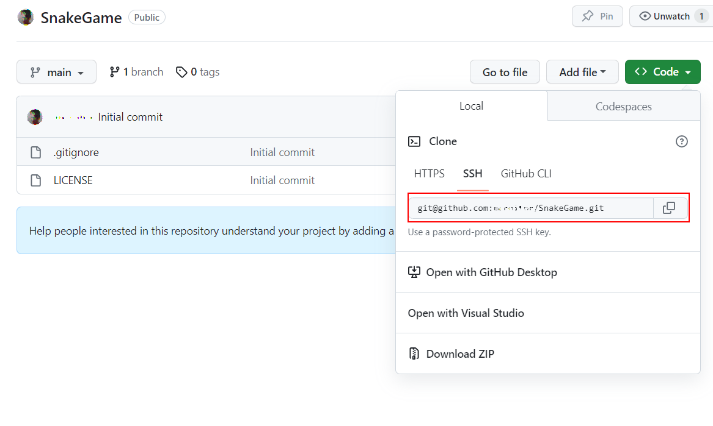

# Lucrare de laborator nr. 1: Lucrul cu GIT

## Scop

După realizarea acestei lucrări, studentul va învăța să lucreze cu sistemul de control al codului GIT.

## Sarcină

Creați un proiect de profil pe GITHUB.

Pentru a simplifica procesul, se recomandă efectuarea pașilor în mediul de dezvoltare `Visual Studio Code`. De asemenea, pe calculator trebuie să fie instalat `GIT`.

### 1. Înregistrare pe [GitHub](https://github.com/)

Înregistrați-vă pe GitHub.

### 2. Crearea proiectului

După autentificarea pe GitHub, în colțul din dreapta sus există o pictogramă `+`. Apăsând pe aceasta, puteți crea un nou repository.


Creați un repository nou, gol, și denumiți-l identic cu numele de utilizator de pe GITHUB.

### 3. Clonarea repository-ului pe calculatorul local

Creați o copie locală a repository-ului pe care l-ați creat. Pentru aceasta, copiați link-ul către repository.



Deschideți linia de comandă, navigați în folderul unde doriți să păstrați proiectul și executați comanda:

```bash
git clone <copied url>
```

Creați o ramură nouă pentru realizarea lucrării.

```bash
# creați o ramură nouă și treceți pe ea
git checkout -B lab01
```

### 4. Crearea structurii de fișiere

Adăugați în folderul proiectului următoarele fișiere:

1. `readme.md` - descrierea proiectului
2. `images` - folder pentru stocarea imaginilor

### 5. Adăugarea descrierii proiectului

În fișierul `readme.md` adăugați:

1. Salutare
2. Fotografie / avatar
3. Scurtă descriere personală
4. Domenii de interes
5. Limbaje de programare
   1. pe care le cunoașteți
   2. pe care le studiați
   3. pe care doriți să le învățați
6. Modalități de contact

### 6. Publicarea codului pe GitHub

În folderul repository-ului executați următoarele comenzi din linia de comandă:

```bash
# adăugați toate fișierele pentru urmărire
git add *
# verificați statusul
git status
# creați un commit
git commit -m "structure defined"
# trimiteți commit-ul către repository-ul remote
git push
```

După aceasta, puteți adăuga ramura creată la ramura `main`.

## Prezentare

La prezentarea răspunsului atașați link-ul către repository.

## Evaluare

- `1 punct` – crearea contului pe GitHub;
- `1 punct` – crearea repository-ului cu denumirea identică cu numele de utilizator;
- `1 punct` – crearea descrierii proiectului în fișierul `README.md`;
- `1 punct` – utilizarea paragrafelor `markdown`;
- `1 punct` – utilizarea titlurilor `markdown`;
- `1 punct` – utilizarea listelor `markdown`;
- `1 punct` – utilizarea imaginilor `markdown`;
- `1 punct` – publicarea codului pe GitHub în ramura `lab01` și unirea cu `main`;
- `2 puncte` – susținerea lucrării;
- `-1 punct` – pentru fiecare zi de întârziere la predare;
- `-5 puncte` – pentru copierea codului de la alți studenți.
