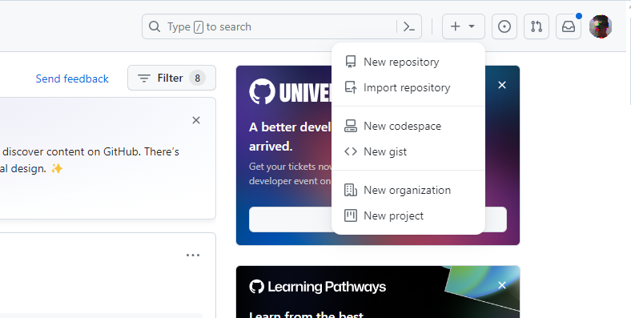

# Lucrare de laborator Nr1: Lucrul cu GIT

## Scop

După executarea acestei lucrări, studenții vor fi capabili să lucreze cu sistemul de control al codului GIT.

## Sarcina

Crearea unui proiect de profil pe GITHUB.

Cu scopul simplificării lucrului, se propune să se efectueze pașii în mediul de dezvoltare `Visual Studio Code`. De asemenea, pe calculator trebuie să fie instalat `GIT`.

### 1. Registrarea contului [GitHub](https://github.com/)

_TODO: some text will be placed here._

### 2. Crearea unui proiect

După autentificare pe GitHub, în colțul din dreapta sus există un buton `+`. Apăsând pe el, puteți crea un repozitoriu nou.



Creați un repozitoriu nou gol, dați-i un nume care să coincidă cu numele de conectare la GITHUB.

### 3. Clonarea repozitoriului pe calculatorul local

Creați o copie locală a repozitoriului pe care l-ați creat. Pentru aceasta copiați referința repozitoriului.


Deschideți linia de comandă, navigați în directorul în care doriți să păstrați proiectul și executați comanda:

```bash
git clone <copied url>
```

Creați o nouă ramură și treceți la ea.

```bash
# create a new branch and switch to
git checkout -B lab01
```

### 4. Crearea structurii fișierelor

Adăugați în directorul proiectului următoarele fișiere:

1. `readme.md` - descrierea proiectului
2. `images` - un director pentru stocarea imaginilor

### 5. Adăugarea descrierii proiectului

În fișier `readme.md` adăugați:

1. Salutare
2. Foto / avatar
3. O scurtă descriere a ta
4. Domeniile de interes
5. Limbaje de programare
   1. care le cunoașteți
   2. care le învățați
   3. care le doriți să le învățați
6. Cum să vă contactez

### 6. Publicarea codului pe GitHub

În directorul repozitoriului, executați următoarele comenzi din linia de comandă:

```bash
# add all files to tracking
git add *
# check status
git status
# create a commit
git commit -m "structure defined"
# push commit to remote repository
git push
```

După aceasta, puteți adăuga ramura creată la ramura `main`.

## Prezentare

Pentru prezentarea lucrului efectuat indicați referința la repozitoriul creat în răspuns la sarcina.

## Modul de evaluare
