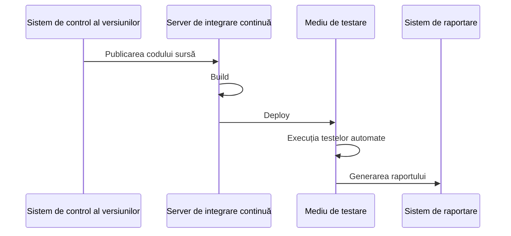

# Integrare și livrare continuă (CI / CD)

- [Integrare și livrare continuă (CI / CD)](#integrare-și-livrare-continuă-ci--cd)
  - [Integrare continuă](#integrare-continuă)
    - [Organizarea integrării continue](#organizarea-integrării-continue)
    - [Avantaje și dezavantaje ale integrării continue](#avantaje-și-dezavantaje-ale-integrării-continue)
  - [Livrare continuă](#livrare-continuă)
  - [Exemplu de proces CI / CD](#exemplu-de-proces-ci--cd)
    - [Organizarea codului](#organizarea-codului)
    - [Model orientativ](#model-orientativ)
    - [Instrumente](#instrumente)
    - [Infrastructura pentru CI / CD](#infrastructura-pentru-ci--cd)
  - [Utilizarea containerelor în procesele CI / CD](#utilizarea-containerelor-în-procesele-ci--cd)
  - [Bibliografie](#bibliografie)

Dezvoltarea modernă a produselor software seamănă cu organizarea unei linii de producție. Fiecare etapă a dezvoltării software trebuie să fie automatizată și integrată într-un proces comun. Pentru aceasta se folosesc instrumente și tehnologii specializate, precum _integrarea continuă_ (CI) și _livrarea continuă_ (CD).

## Integrare continuă

__Integrarea continuă__ (_Continuous Integration_, CI) este o practică de dezvoltare software în care modificările aduse de dezvoltatori sunt integrate în baza de cod comună de mai multe ori pe zi. Fiecare integrare este verificată prin build-uri și teste automate, ceea ce permite identificarea și corectarea rapidă a erorilor.

De obicei, mai mulți dezvoltatori lucrează independent la același proiect, fiecare putând aduce modificări de mai multe ori pe zi. Pentru a evita conflictele și erorile la integrarea modificărilor, se utilizează practica integrării continue. Aceasta presupune ca la fiecare modificare a codului să se lanseze automat build-ul și testarea aplicației.

### Organizarea integrării continue

Pentru organizarea procesului de integrare continuă trebuie îndeplinite următoarele cerințe:

- utilizarea unui sistem de control al versiunilor pentru stocarea codului sursă;
- configurarea build-ului și testării automate la fiecare modificare.

În cadrul integrării continue, pe un server dedicat rulează un serviciu specializat care, la apariția unui eveniment, execută următorii pași:

1. Preluarea codului sursă din sistemul de control al versiunilor;
2. Build-ul aplicației;
3. Deploy-ul aplicației într-un mediu de testare;
4. Lansarea testelor automate;
5. Trimiterea raportului cu rezultatele testării către dezvoltatori.

Pot exista și build-uri programate (_daily build_ sau _nightly build_). Acest lucru permite reducerea încărcării serverului de integrare continuă și oferă dezvoltatorilor build-uri regulate pentru testare.

### Avantaje și dezavantaje ale integrării continue

Avantajele integrării continue:

- identificarea și corectarea rapidă a erorilor;
- rularea imediată și regulată a testelor;
- existența permanentă a unei versiuni stabile a aplicației;
- efectul imediat al codului incomplet îi obișnuiește pe dezvoltatori cu lucrul iterativ.

Dezavantaje ale integrării continue:

- costuri suplimentare pentru menținerea integrării continue;
- necesitatea unor resurse suplimentare pentru asigurarea integrării continue.

## Livrare continuă

__Livrarea continuă__ (_Continuous Delivery_, CD) este o practică de dezvoltare software în care fiecare modificare a codului trece prin teste automate de calitate și securitate și este pregătită pentru lansare în producție. Aceasta permite dezvoltatorilor să livreze rapid și sigur modificările către utilizatori.

Pe lângă livrarea continuă, poate fi organizat și __deploy-ul continuu__ (_Continuous Deployment_), în care fiecare modificare a codului este lansată automat în producție fără intervenția dezvoltatorilor. Acest lucru reduce timpul dintre scrierea codului și lansarea sa, simplificând procesul de release. Totuși, deploy-ul continuu necesită un control mai riguros al calității și securității codului pentru a evita erorile în mediul de producție.

Diferența dintre livrarea continuă și deploy-ul continuu constă în faptul că, în primul caz, dezvoltatorii decid când să lanseze modificările în producție, iar în al doilea caz acest lucru se întâmplă automat.

În practică, organizarea proceselor CI / CD impune cerințe suplimentare asupra infrastructurii și proceselor de dezvoltare.

## Exemplu de proces CI / CD

### Organizarea codului

Un mod de organizare a lucrului cu codul poate fi următorul:

1. Există o ramură principală de dezvoltare (de exemplu, `main` sau `master`);
2. Pentru dezvoltarea unei funcționalități se creează o ramură separată pe baza ramurii principale (de exemplu, `feature-branch`);
3. După finalizarea dezvoltării funcționalității se creează un pull request pentru ramura principală;
4. După verificarea codului și trecerea cu succes a testelor, pull request-ul este integrat în ramura principală;
5. După integrarea în ramura principală se lansează build-ul și testarea aplicației;
6. La trecerea cu succes a testelor se creează o ramură de release (sau se marchează cu un tag de release);
7. Crearea ramurii de release lansează procesul de deploy al aplicației în mediul de producție.

### Model orientativ

Organizarea procesului CI / CD poate fi reprezentată prin următoarele medii:

- __local__ – mediu local de dezvoltare, instalat pe calculatorul fiecărui dezvoltator;
- __qa__ – mediu pentru integrarea noii funcționalități;
- __staging__ – mediu pentru testarea noii funcționalități;
- __production__ – mediu pentru lansarea noii funcționalități.

Dezvoltatorii lucrează în mediul local, unde creează funcționalități noi și le testează.

După finalizarea dezvoltării, se creează un pull request către ramura `main`. Crearea pull request-ului lansează build-ul și testarea aplicației în mediul `qa`. În mediul `qa` se lansează teste automate care verifică funcționalitatea nouă.

La trecerea cu succes a testelor în mediul `qa`, se integrează ramurile. După integrare, codul din ramura `main` este lansat în mediul `staging`.

Mediul `staging` trebuie să fie cât mai apropiat de mediul de producție, dar poate diferi prin lipsa datelor reale sau resurse mai mici. În acest mediu se lansează funcționalitatea nouă pentru testare. Testarea în mediul `staging` se face manual.

La trecerea cu succes a testelor în mediul `staging`, se creează ramura de release, care lansează procesul de deploy în mediul de producție.

### Instrumente

Pentru organizarea proceselor CI / CD se folosesc instrumente specializate care permit automatizarea build-ului, testării și deploy-ului aplicațiilor:

- __Jenkins__ – instrument popular pentru organizarea proceselor CI / CD.
- __GitLab CI__ – instrument pentru CI / CD integrat cu sistemul de control al versiunilor GitLab. Permite configurarea lanțurilor de build, testare și deploy, precum și gestionarea lor prin interfața web GitLab.
- __TeamCity__ – instrument pentru CI / CD dezvoltat de JetBrains.
- __CircleCI__ – instrument pentru CI / CD integrat cu GitHub.
- __Github Actions__ – instrument pentru CI / CD integrat cu GitHub. Permite configurarea lanțurilor de build, testare și deploy, precum și gestionarea lor prin interfața web Github Actions.
- __AWS CodeBuild__, __AWS CodePipeline__ – instrumente pentru CI / CD integrate cu platforma cloud Amazon Web Services (AWS).
- __Azure DevOps__ – instrument pentru CI / CD integrat cu platforma cloud Microsoft Azure.
- __Atlassian Bamboo__ – instrument pentru CI / CD dezvoltat de Atlassian.

Alegerea instrumentului sau a instrumentelor depinde de cerințele proiectului, tehnologiile folosite și preferințele echipei de dezvoltare.

### Infrastructura pentru CI / CD

Pentru organizarea proceselor CI / CD este necesară o infrastructură specializată care să permită automatizarea build-ului, testării și deploy-ului aplicațiilor:

- __Docker__ – platformă populară pentru dezvoltarea, livrarea și rularea aplicațiilor în containere. Docker permite împachetarea aplicațiilor și a dependențelor lor în containere, simplificând deploy-ul și scalarea.
- __Kubernetes__ – platformă pentru automatizarea deploy-ului, scalării și gestionării aplicațiilor containerizate. Kubernetes permite gestionarea unui cluster de servere pe care rulează containerele și asigură disponibilitate și scalabilitate ridicată.
- __Terraform__ – instrument pentru gestionarea infrastructurii ca și cod. Terraform permite descrierea infrastructurii în fișiere de configurare și automatizarea deploy-ului și gestionării acesteia.
- __Ansible__ – instrument pentru automatizarea gestionării configurațiilor și deploy-ului aplicațiilor. Pe baza playbook-urilor, Ansible instalează automat aplicațiile pe serverele țintă.

## Utilizarea containerelor în procesele CI / CD

Utilizarea containerelor în procesele CI / CD simplifică deploy-ul și scalarea aplicațiilor, asigurând izolare și securitate. Totuși, este important să respectați anumite reguli și recomandări pentru a evita probleme de performanță și securitate, de exemplu, minimizarea dimensiunii containerelor și gestionarea secretelor.

Containerele permit împachetarea aplicațiilor și a dependențelor lor în medii izolate, simplificând deploy-ul și gestionarea. În plus, aplicațiile pot fi rulate în orice mediu unde este instalat Docker, asigurând portabilitate și scalabilitate.

Majoritatea instrumentelor moderne pentru CI / CD suportă lucrul cu containere, ba chiar pașii procesului CI / CD sunt implementați în containere, adică:

- sistemul CI / CD rulează în container;
- fiecare pas al procesului CI / CD se execută într-un container separat;
- adesea aplicația finală este împachetată tot într-un container.

Utilizarea containerelor simplifică transferul aplicației între medii, deoarece containerul construit pentru mediul `qa`, după trecerea cu succes a testelor, poate fi folosit și pentru mediile `staging` și `production`.

## Bibliografie

1. [Continuous Integration, Wikipedia](https://en.wikipedia.org/wiki/Continuous_integration)
2. [Continuous Delivery, Wikipedia](https://en.wikipedia.org/wiki/Continuous_delivery)
3. [Jenkins](https://www.jenkins.io/)
4. [GitLab CI](https://docs.gitlab.com/ee/ci/)
5. [TeamCity](https://www.jetbrains.com/teamcity/)
6. [CircleCI](https://circleci.com/)
7. [Github Actions](https://docs.github.com/en/actions)
8. [Docker](https://www.docker.com/)
9. [Kubernetes](https://kubernetes.io/)
10. [Terraform](https://www.terraform.io/)
11. [Ansible](https://www.ansible.com/)
12. [Continuous integration with Docker, Docker](https://docs.docker.com/build/ci/)
13. [Introduction to GitHub Actions, Docker](https://docs.docker.com/build/ci/github-actions/)
14. [MaxRokatansky, Ce este CI/CD? Integrare și livrare continuă, Habr.com](https://habr.com/ru/companies/otus/articles/515078/)
15. [Ce este livrarea continuă?, Microsoft](https://learn.microsoft.com/ru-ru/devops/deliver/what-is-continuous-delivery)
